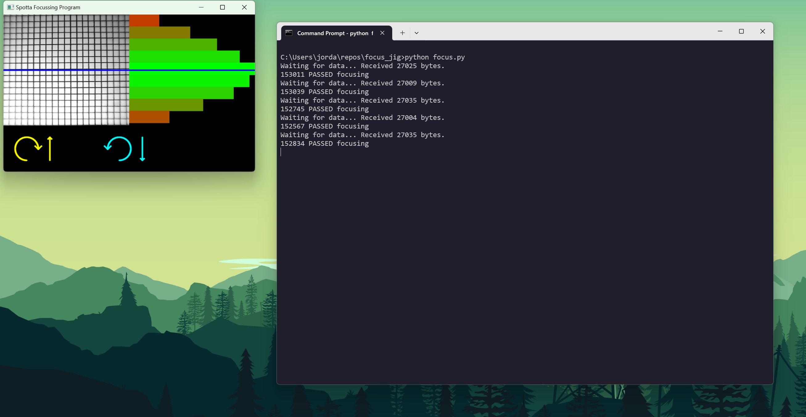

# Focusing Jig

## Bed Pod - Hardware Setup
1. Plug the USB C charging cable into the LED panel
2. Turn on the LED panel, **turn the wheels so the LEDs are as dim as possible and as blue as possible**
3. Plug the 5V barrel jack into the red pcb
4. Connect the red pcb to the PC using a USB cable

Once connected it should look like this...

## Bed Pod - Focusing steps
1. Click on the "Focus Bed Pod v11" icon on the desktop to open the focusing program
2. Put a Bed Pod PCB into the focusing jig and clamp down. The PCBs yellow LEDs should be flashing once per second 
   there should now be a low frame rate video feed appearing on the screen.
2. Turn the lens on the camera until the image on the screen appears in focus. A sharpness score will be given for each 
   image frame.
3. The score needs to be above a certain threshold to be considered a pass and allow the PCB to move on to the next
   step in the manufacturing process. If the operator is unable to get the score above this value then this PCB should
   be considered faulty.

-----------------------------------------------------------------------------------------------------

## Forest Pod - Hardware Setup
_Todo_

## Forest Pod - Focusing steps
1. Click on the "Focus Forest Pod v7" icon on the desktop to open the focusing program
2. Place the Forest Pod PCB inside the 3D printed Focus Jig housing. The video feed should now show a grid
3. Twist the camera lens until the middle of the image (where the blue line is) is sharp/in focus. Note: The bar graph
lines to the right of the video feed help show which areas of the image are most in focus.

-----------------------------------------------------------------------------------------------------

## Bed Pod - Software Setup

1. Install Ubuntu 24.04 LTS
2. Run `git clone https://github.com/spotta-uk/focus-jig.git` to get this repository. The recommended location for this
repos is ~/repos/focus-jig
3. Run `sudo ./install_focus_jig_on_linux.sh`. This shell script will likely need to be made executable before it will run.
4. Run `sudo cp "focus bedpodv11.desktop" "~/Desktop/focus bedpodv11.desktop"` to put a shortcut for the focusing program
on the desktop. Open this file and replace USER_NAME_GOES_HERE with the actual pc username. Then right hand click on the
desktop icon and click "Allow Launching" to enable the shortcut.
5. Reboot the PC (necessary step to allow updated usb permissions to take effect)

