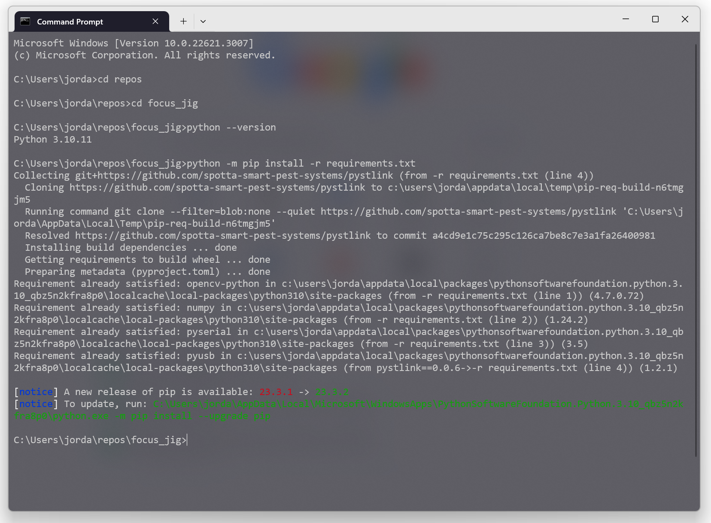
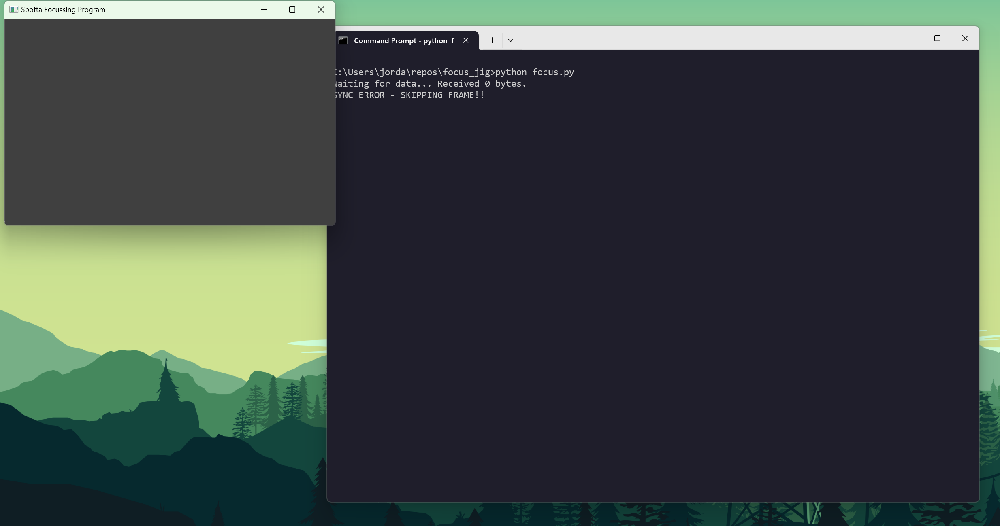

# Focusing Jig

## Hardware Setup - Bed Pod
1. Move the toggle switch to the right position
2. Plug the 5V barrel jack into the red pcb
3. Plug the 12V barrel jack in, this will turn on the LED lighting
4. Connect the red pcb to the PC using a USB cable

Once connected it should look like this...


## Software Setup - Windows
1. Install python 3 https://www.python.org/downloads/ (Last tested using python 3.12.1)
2. Install git https://git-scm.com/download/win (Last tested using git 2.43.0)
3. Install STM32CubeProg https://www.st.com/en/development-tools/stm32cubeprog.html (Last tested using 2.15.0)
4. Open command prompt and navigate to the focus_jig repository.\
   Check that python 3 is installed by running... `python --version` \
   Install the required python packages using... `python -m pip install -r  requirements.txt`\
   It should look like this...




5. Run the python focusing script `python focus.py`. .



## Focus a Bed Pod
1. Put a Bed Pod PCB into the focusing jig and clamp down.
2. Open the STM32CubeProg software. Click connect.
3. Program the Bed Pod PCB with bedpodv7-focus.srec
4. Put a Bed Pod PCB into the focusing jig and clamp down. The PCBs yellow LEDs should be flashing once per second 
   there should now be a low frame rate video feed appearing on the screen.
5. Turn the lens on the camera until the image on the screen appears in focus. A sharpness score will be given for each 
   image frame.


6. The score needs to be above a certain threshold to be considered a pass and allow the PCB to move on to the next
   step in the manufacturing process. If the operator is unable to get the score above this value then this PCB should
   be considered faulty.

-----------------------------------------------------------------------------------------------------

## Software Setup - Linux

1.  Put this repository in ~/focus_jig
2.  Install packages using the commands below...
    ```shell
    sudo apt -y install python3.8
    sudo apt -y install pip
    sudo apt -y install git
    sudo apt -y install libboost-python-dev
    sudo apt -y install libfmt-dev
    sudo apt -y install libusb-1.0-0-dev
    ```
3.  Run ```~/focus_jig$ python3.8 -m pip install -r  requirements_linux.txt``` 
4.  Allow read and write access to the usb STLINK devices. For Ubuntu users this is done by creating a new rules file
using the command... ```sudo nano /etc/udev/rules.d/90-my-extra-usb.rules``` and then fill the file with...
    ```shell
    # STLINK-V2
    SUBSYSTEM=="usb", ATTRS{idVendor}=="0483", ATTRS{idProduct}=="3748", MODE="0666"
    # STLINK-V3
    SUBSYSTEM=="usb", ATTRS{idVendor}=="0483", ATTRS{idProduct}=="374f", MODE="0666"
    ```
    save the file and exit nano. Now run the command ```sudo udevadm control --reload``` to reload the usb rules.

    If the Factory Programming PCB was plugged in at this point then it should be unplugged and re-plugged in


## Focus a Forest Pod PCB

1. Setup video feed as per the instructions above
2. Place the Forest Pod PCB inside the 3D printed Focus Jig housing. The video feed should now show a grid
3. Twist the camera lens until the middle of the image (where the blue line is) is sharp/in focus. Note: The bar graph
lines to the right of the video feed help show which areas of the image are most in focus.

